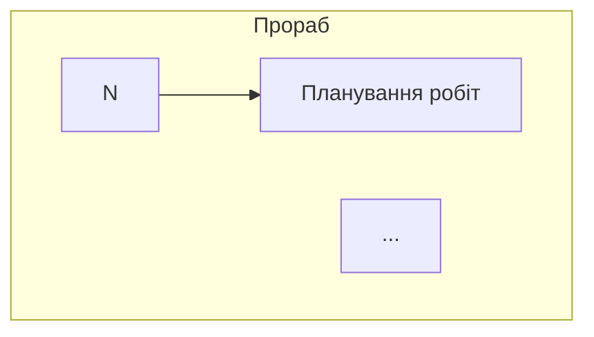

# FINEKO Bug Report v14

> Документ для агента у VS Code. Баги і фічі після закриття v13.

---

## BUG-017 · Адмін-панель «Деталі сесії» — Mermaid рендериться як сирий текст

**Статус:** Відкритий  
**Пріоритет:** Середній  
**Виявлено при:** Перегляд сесії `75499024` бота 1.2 в адмін-панелі → вкладка «Чат»

**Симптоми:**  
У вкладці «Чат» деталей сесії повідомлення від бота що містять Mermaid-код відображаються як сирий текст з бачками:
```

```
замість відрендереної діаграми.

**Очікувана поведінка:**  
Адмін-панель має розпізнавати блоки ` ```mermaid ` в повідомленнях і рендерити їх як SVG-діаграму (через mermaid.js або аналог) прямо в чаті.

**Що зробити:**  
У компоненті відображення повідомлень чату — додати рендерер для Mermaid-блоків. Аналогічно як це робить GitHub або Notion.

Приклад з mermaid.js:
```javascript
import mermaid from 'mermaid';
// При рендері повідомлення — знайти ```mermaid блоки і замінити на SVG
mermaid.initialize({ startOnLoad: false });
const { svg } = await mermaid.render('diagram', mermaidCode);
```

---

## BUG-018 · В Telegram студенту відправляється сирий Mermaid-код замість PNG

**Статус:** Відкритий — чекає реалізації FEATURE-003  
**Пріоритет:** Високий  
**Виявлено при:** Тест Bot 1.2 в Telegram

**Симптоми:**  
Студент в Telegram бачить сирий Mermaid-код як текстове повідомлення замість красивої PNG-картинки зі swimlane-схемою.

**Причина:**  
FEATURE-003 (ноди `jsEncode` → `httpRequest binary` → `sendPhoto`) ще не реалізована на бекенді. Поки ноди `jsEncode`, `httpRequest` з `responseType: binary` і `sendPhoto` не підтримуються — PNG не генерується.

**Тимчасовий воркараунд (поки FEATURE-003 не реалізована):**  
Додати в `msg_done` Bot 1.2 посилання на Mermaid Live Editor з base64-кодом схеми — студент зможе хоча б переглянути схему онлайн:
```
📊 Переглянь схему онлайн: https://mermaid.live/edit#...
```

**Довгострокове рішення:** реалізувати FEATURE-003 з `jsEncode` → `httpRequest(mermaid.ink)` → `sendPhoto`.

---

## BUG-006 · `user_confirms` exitCondition — нода не переходить до saveFile

**Статус:** Відкритий (перенесено з v13, ще не виправлено)  
**Пріоритет:** Критичний — блокує Bot 1.2 і Bot 2.1  

**Симптоми:**  
Після того як студент підтверджує («Так, все вірно!») і Claude генерує фінальний документ — `waitingForUser: true` залишається, нода не переходить до `save_result`. `filesCreated: 0`.

**Підтверджено на:**
- Bot 1.2 (сесія `75499024`) — схема побудована, підтверджена, але saveFile не спрацював
- Bot 2.1 (сесія `03b20a7c`) — YAML ідеальний, підтверджений, але saveFile не спрацював
- Bot 1.1 — **працює** (той самий `user_confirms`)

**Різниця між 1.1 (працює) і 1.2/2.1 (не працює):**  
В Bot 1.1 Claude генерує чистий JSON без додаткового тексту.  
В Bot 1.2/2.1 Claude генерує великий Markdown/YAML документ — можливо є timeout або розмір відповіді впливає на обробку exitCondition.

**Що перевірити:**  
Чи є обмеження на розмір відповіді при перевірці `user_confirms`? Чи обробляється exitCondition після довгих відповідей так само як після коротких?

---

## BUG-012 · BigInt serialization error в Bot 2.2

**Статус:** Відкритий (перенесено з v13, ще не виправлено)  
**Пріоритет:** Критичний — блокує Bot 2.2  

**Помилка:** `"Do not know how to serialize a BigInt"`  
**Фікс:** `JSON.stringify(payload, (key, value) => typeof value === 'bigint' ? value.toString() : value)`  
Або конвертувати `telegram_id` в рядок при збереженні в контекст сесії.

---

---

## FEATURE-016 · MCP — додати `update_bot` інструмент для редагування метаданих бота

**Статус:** Відкритий  
**Пріоритет:** Середній  

**Опис:**  
Зараз через MCP неможливо оновити метадані бота — назву, slug, опис, goal. Є тільки `update_node` і `update_funnel_key`. Потрібен інструмент `update_bot`.

**Пропонований інструмент:**
```json
{
  "name": "update_bot",
  "params": {
    "botId": "string",
    "name": "string (optional)",
    "description": "string (optional)",
    "goal": "string (optional)",
    "outputFiles": ["string"] 
  }
}
```

**Використання:** AI-агент зможе прописувати опис і мету кожного бота прямо через MCP без ручного редагування в UI.
